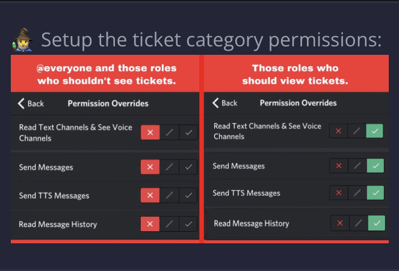

# Ticketing help

## How do I set up the Ticket system?

* In order to set up the ticket system, you can just type: `!enable-tickets`

<figure><figcaption></figcaption></figure>

<figure><figcaption></figcaption></figure>

After you enable the ticket system, you can then set the bot ticket settings from there. Once you finish setting up this system, everything should work right after\
\
Click [here](https://ravi-docs.gitbook.io/ravi-documentation/commands-list/ticketing) to see the full list of ticket commands\
\
Discord will automatically sync its category permissions when new channels are created, with the channels if Discord does not sync its perms you must go to the channel settings and press "sync perms" to sync them manually.
